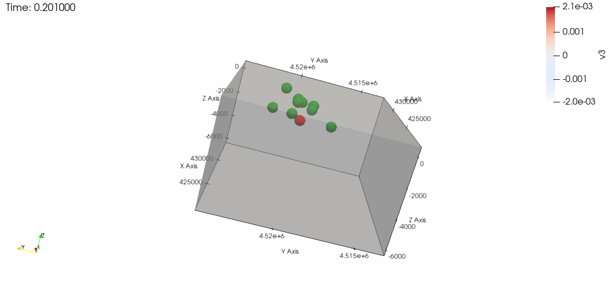

# JSWAP

[](https://github.com/deconvolution/JSWAP/actions/workflows/Documenter.yml)
[](https://github.com/deconvolution/JSWAP/actions/workflows/Runtests.yml)
[](https://deconvolution.github.io/JSWAP/dev/)

A Julia package for Sound WAve Propagation (JSWAP).

Simulation for Campi Flegrei. Unit of time: s. Red dots: source. Green dots: receivers. X: Latitude. Y: Longitude. Z: Altitude [m]. v3: Vertical particle velocity [m/s].
## Contents
* [Target](#Target)
* [Highlights](#Highlights)
* [Installation](#Installation)
* [Dependencies](#Dependencies)
* [Usage](#Usage)
## Target
The target of this package is to create an easy-to-use package for viscoelastic wave propagation in heterogenous media.
## Highlights
Some of the highlights are:
- The physics is acoustic-elastic coupling wave equations, including Kelvin-Voigt viscoelastic material.
- Anisotropy and random media can be added to the velocity model.
- This package is based on [ParallelStencil.jl](https://github.com/omlins/ParallelStencil.jl). Parallelization has been implemented. The package ParallelStencil.jl was modified to adapt higher-order accuracy finite-difference scheme (up to 12 points of spacial derivative).
- The output (including animation) can be loaded to [Paraview](https://www.paraview.org/).
## Installation
In an IDE with Julia installed (e.g., [Atom](https://atom.io/)), one can install this package by
```julia
julia> ]
(@v1.5) pkg> add https://github.com/deconvolution/JSWAP
```
You can test whether it works on your system with
```julia
julia> ]
(@v1.5) pkg> test JSWAP
```
and use it with
```julia
julia> using JSWAP
```
## Dependencies
JSWAP dependes on [ParallelStencil.jl](https://github.com/omlins/ParallelStencil.jl), [CUDA](https://github.com/JuliaGPU/CUDA.jl), and [WriteVTK.jl](https://github.com/jipolanco/WriteVTK.jl). They will be installed automatically under JSWAP and there is no need to install them separately.
## Usage
You can find the [manual](https://deconvolution.github.io/JSWAP/dev/) for details, which explains input, output and some utilities.
