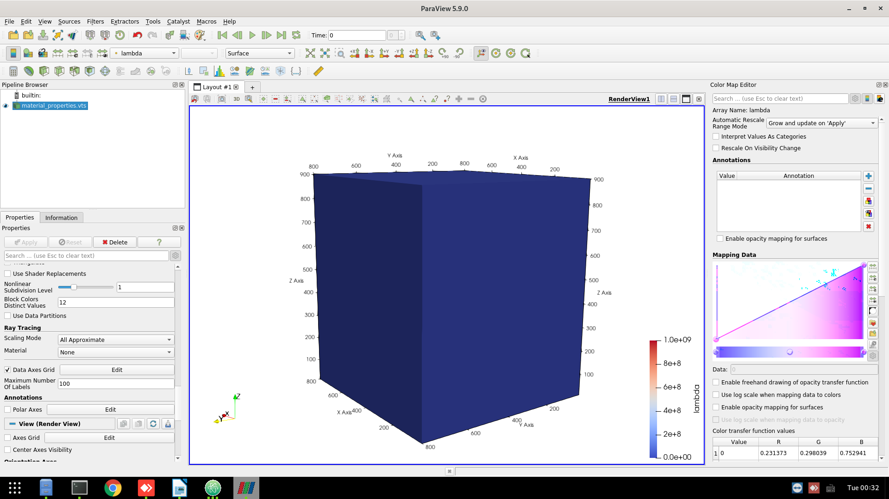
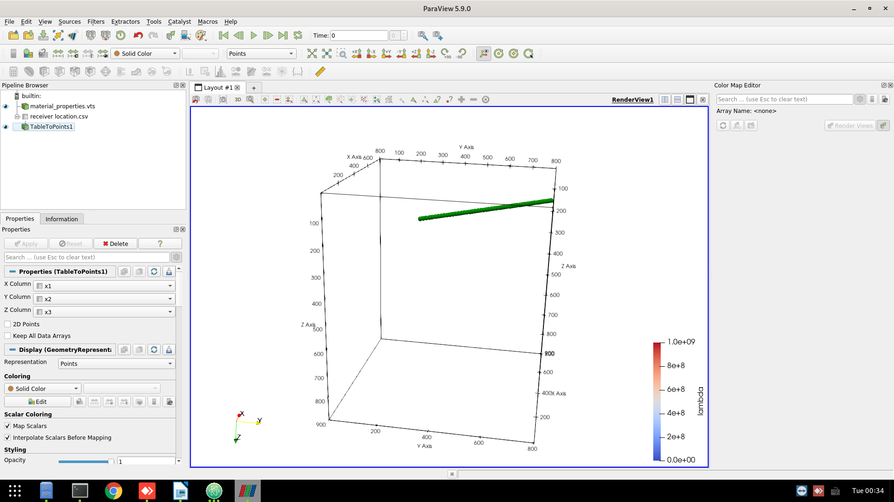
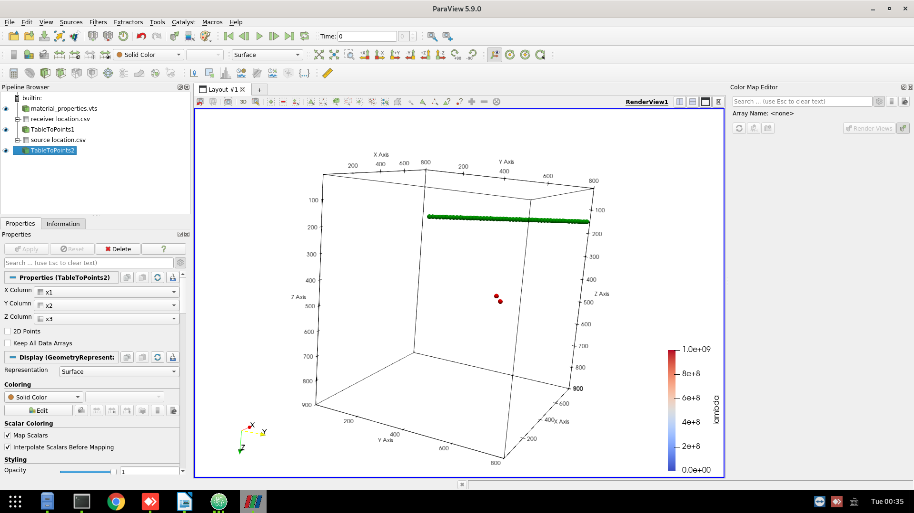
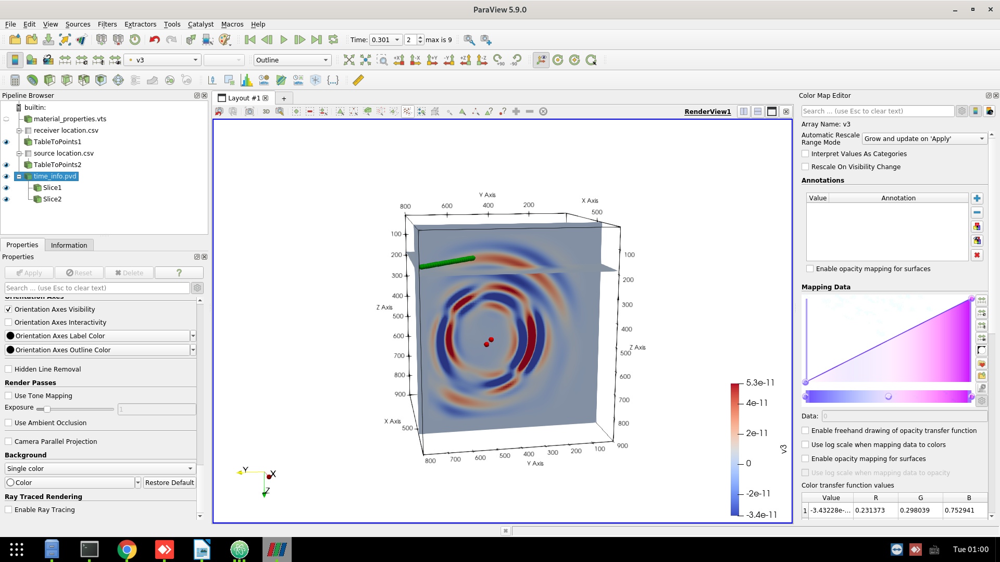
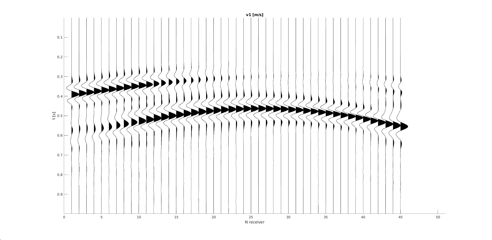
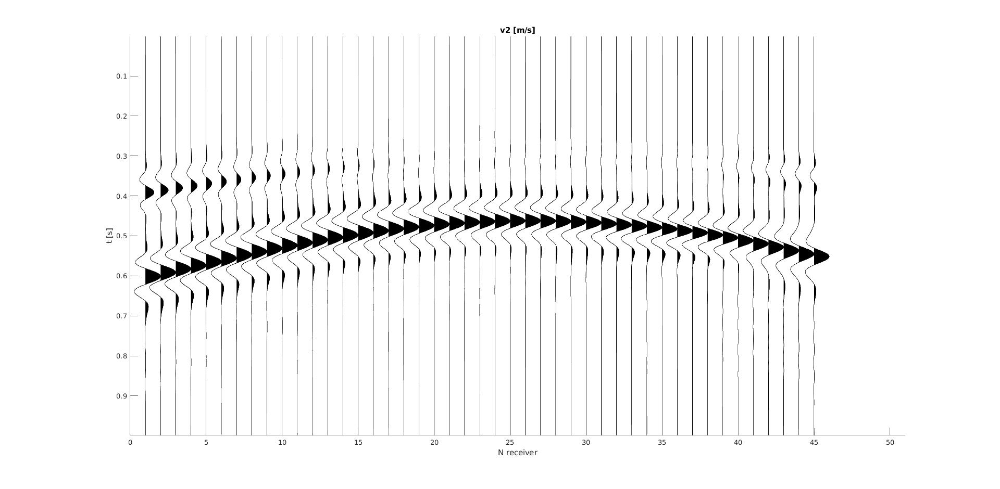
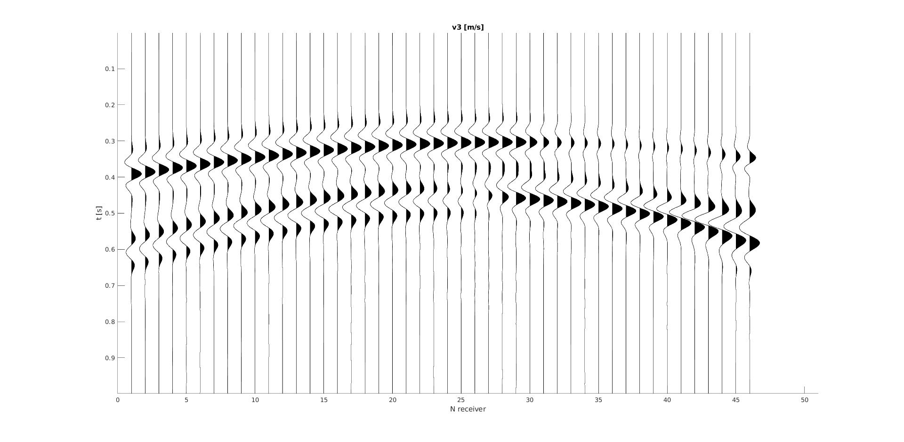
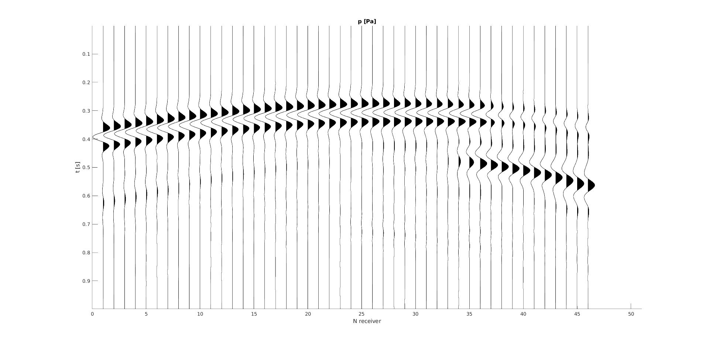

After running the "main_body.jl", a folder for output will be generated in the destination specified in the input file. For instance, the example "template_2momenttensors" will have a folder called "main_body", in which there are "model", "pic", "rec" and "wavefield" and "time_info.pvd". Each of them will be explained in details. ParaView is needed to visualize the model and the wavefield.

 # 1. model setup
 The folder "model" contains "material_proporties.vts", which can be loaded to ParaView.
 
 The source and receiver true locations are stored in "source location.csv" and "receiver location.csv", respectively. There are 3 columns for the locations. They are corresponding to x, y and z coordinates. The first row is the header. With the "data to points" filter in paraview, they can be visualized with dots in 3D.
 
 Here is an overview of the model setup with source (red dots) and receiver (green dots).
 

 # 2. Wavefield animation
 The file "time_info.pvd" is the conclusive file which tells the path of the wavefield snapshot (under "./pic") and the time. Loading "time_info.pvd" to paraview is a good way to visualize the wavefield.
 

 # 3. Wavefield .mat file
 If the wavefield is saved (check input file), then the folder "wavefield" contains the wavefield, including v1, v2, v3, sigmas11, sigmas22, sigmas33, sigmas23 and p.

 # 4. Seismogram
 The recording files are saved under the folder "rec".
 * rec_1.mat: seismogram x component.
 * rec_2.mat: seismogram y component.
 * rec_3.mat: seismogram z component.
 * rec_p.mat: seismogram pressure component.
 
 
 
 
